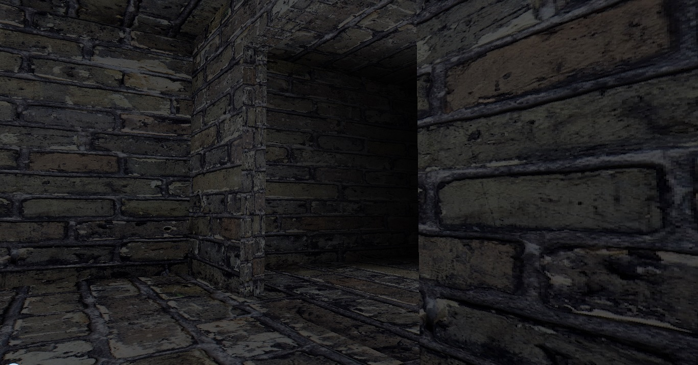
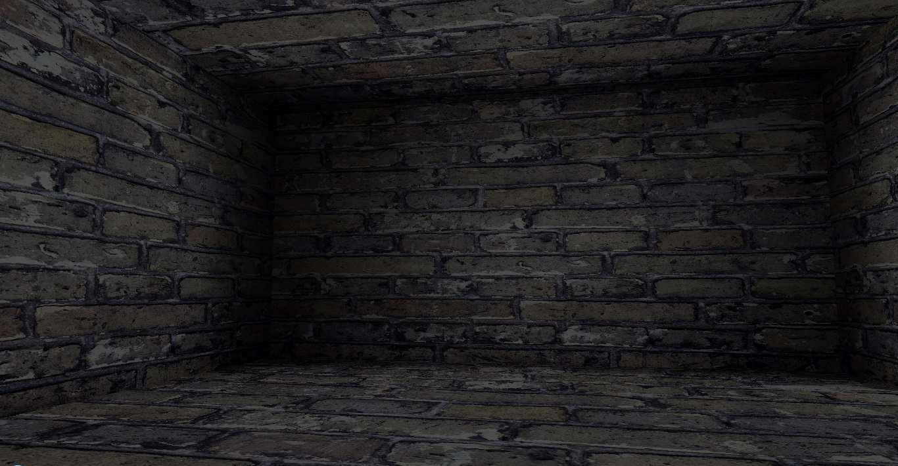

##About this project
This project uses the JOGL library ([their website](https://www.jogamp.org)) and was designed as a basis for 3D games in the future. 
All of the libraries are included inside the project, which was built using Eclipse Juno. 
The user may walk around the environment using WASD and rotate the camera using the mouse.

NOTE: ONLY TESTED ON WINDOWS 7
##Screenshots

